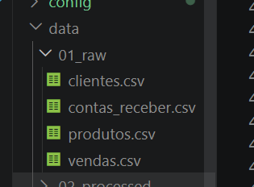
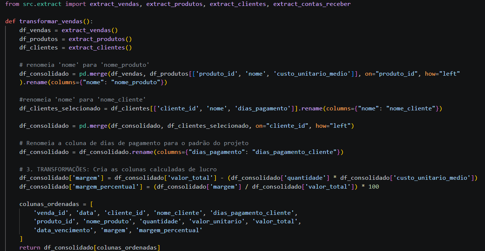
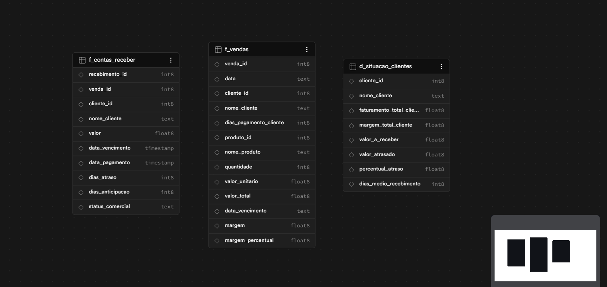
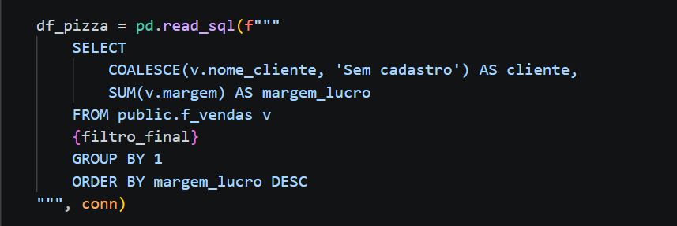
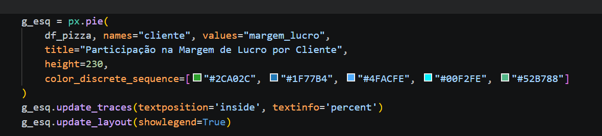
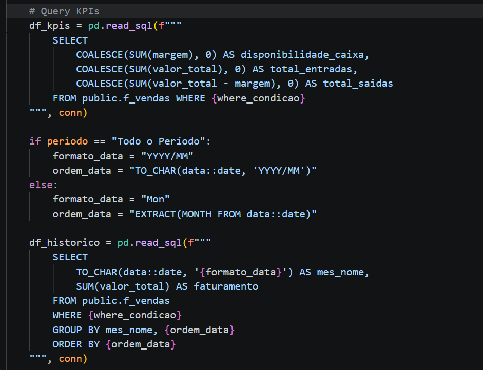
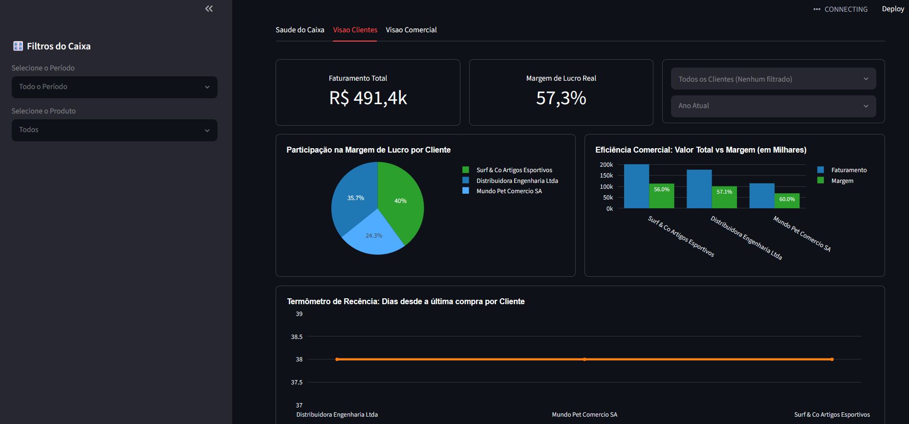

# 🏥 Data Pipeline: Saúde do Caixa & Inteligência Analítica
> 🇺🇸 **Looking for English?** [Click here for the English version](./README.md).

 

Estrutura do Pipeline

---

## 📌 Descrição do Projeto

Este projeto foi desenvolvido para ser implementado no mundo real. Ele foi criado como uma forma de apresentar o contexto estratégico para o gestor da empresa de um conhecido meu.

Após a aprovação, a solução será implementada no dia a dia da organização, consumindo os dados diretamente da API do ERP Omie. Para a criação do modelo atual, utilizei arquivos CSV gerados por Inteligência Artificial para simular a massa de dados e mostrar um resultado muito próximo ao que teremos após a integração oficial.

**Ideia principal:** Criar um pipeline de dados que se alimenta de forma automatizada via API e projeta as informações em um dashboard com atualização diária. O objetivo é que o gestor tenha uma leitura apurada do que acontece todos os dias em seu negócio, podendo navegar por diferentes abas e interagir com filtros e gráficos.

---

## 🛠️ Tecnologias Utilizadas

* **Database:** PostgreSQL hospedado na nuvem via **Supabase** (Armazenamento, relacionamento e consultas analíticas)
* **Interface e UI:** **Streamlit** para construção do Web App modular em Dark Mode
* **Charts:** **Plotly (Express & Graphical Objects)** para criação de gráficos financeiros e comerciais responsivos
* **Linguagem Principal & ETL:** **Python** (Pandas para modelagem e tratamento de dados brutos)
* **Arquitetura de Software:** Estrutura modular desacoplada separando lógica de dados (`view/`) de templates visuais (`wsidebar.py`)

No momento atual, utilizei arquivos CSV para apresentar o conceito e simular os dados; no futuro, as informações virão diretamente da API.

---

## 💽 Processo de ETL (Extract, Transform, Load)

Utilizando a biblioteca Pandas, os dados passaram pelo fluxo completo de Extração, Transformação e Carga.
Para estruturar a base de dados final, foi necessário realizar o cruzamento de chaves (operações de `merge`) e a normalização de colunas, garantindo a consistência das informações antes da exportação para a nuvem.

Após serem modelados para garantir a melhor performance, os arquivos foram carregados no Supabase. No início do processo, tínhamos 4 arquivos CSV brutos que, após passarem pelo tratamento e limpeza, foram normalizados e transformados em 3 tabelas lógicas dentro do banco de dados.

---

## ⚡ Arquitetura Modular & Layouts (`wsidebar.py`)

Para manter o código sustentável e de fácil manutenção, o projeto foi desacoplado de forma rígida:

* **Camada Visual Centralizada (`wsidebar.py`):** Arquivo maestro que gerencia a construção de barras laterais, grades de colunas, injeção de CSS Dark Mode e estilização de gráficos do Plotly. Não possui nenhuma conexão com o banco de dados. Essa estrutura foi projetada especificamente para suportar múltiplos layouts. Como a necessidade de visualização dos gráficos pode mudar de acordo com o foco do negócio, essa modularidade facilita uma transição rápida e sem quebras de código. Inclusive, para validar essa flexibilidade, o projeto atualmente conta com **dois tipos de layouts diferentes** implementados e operacionais.

* **Camada de Dados Lógicos (`view/*.py`):** Arquivos específicos para cada tela (Financeiro, Clientes, Comercial). Executam as queries no Supabase, tratam os DataFrames com Pandas e repassam os dados prontos para o construtor visual.

---

## 🧠 Desenvolvimento SQL & Consultas Analíticas

Voltando para os scripts em Python, nos conectamos ao Supabase e iniciamos o processo de consultas (queries) para extrair a inteligência que alimentará a visualização.

Combinando a eficiência do SQL com o poder do Pandas, esse processo foi totalmente dividido: cada query foi desenvolvida isoladamente dentro de sua respectiva página de contexto.

**Exemplo:**
* **Aba Clientes:** Monitoramento da carteira comercial através da análise de lucratividade real por parceiro. O script extrai a participação de contas estratégicas na margem líquida total do negócio, permitindo que o gestor identifique quais clientes geram valor real para o caixa e quais demandam revisão de contrato ou tabelas de preço.

---

* **Aba Financeiro:** Script responsável pelo cálculo em tempo real dos principais KPIs financeiros (Faturamento, Lucro/Margem e Custos Operacionais), agregando os dados de forma dinâmica e respondendo de acordo com filtros temporais.

---

## 📊 Camada de Visualização (Streamlit)

Após o processamento analítico, os dados finalmente aparecem na interface do usuário.

Na ponta final do projeto, poderíamos ter escolhido qualquer ferramenta de visualização do mercado como Power BI ou Looker Studio. Para este cenário, optei pela biblioteca **Streamlit**, pois ela se integra nativamente ao ecossistema Python, é totalmente gratuita e nesse projeto os gráficos escolhidos serão mantidos como padrão, dado que já definimos previamente quais são os pontos cruciais que o gestor deve acompanhar na empresa.

---

## 🎯 Business Problem

O sistema foi projetado para responder perguntas críticas de negócio enfrentadas pela gestão diariamente:

* Qual a nossa Sobra de Caixa Real (Lucro) após deduzir os custos operacionais das vendas?
* Para onde exatamente está escorrendo o dinheiro da empresa (Ralo de Custos por Produto)?
* Como está o nosso ritmo de crescimento histórico (Faturamento Mensal)?
* Quais clientes estão inativos e quais ações práticas o time comercial pode tomar hoje para recuperá-los?

---

## 👨‍💻 Conclusão

* A validação de um MVP visual utilizando dados fictícios provou ser a melhor estratégia de governança de dados. Ela permitiu alinhar as expectativas do usuário final e garantir a usabilidade das telas sem expor dados reais da empresa em fases iniciais de testes.
* O desacoplamento de software (`wsidebar.py` separado de `financeiro.py`) garante que a evolução do projeto para consumir dados reais da API do Omie ocorra sem retrabalho na camada de design. Basta atualizar o motor de dados na pasta `src` e as telas se adaptarão sozinhas.

Este projeto foi um exercício completo de engenharia, arquitetura e análise de dados.

---
*Produzido por Nicolas Rheinheimer - Data Analytics & Data Engineer*
